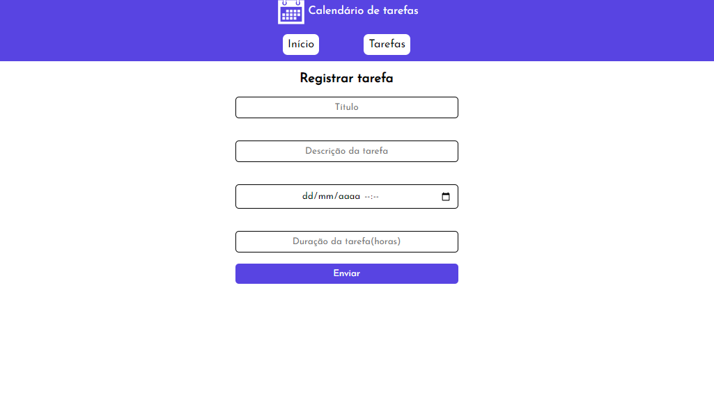
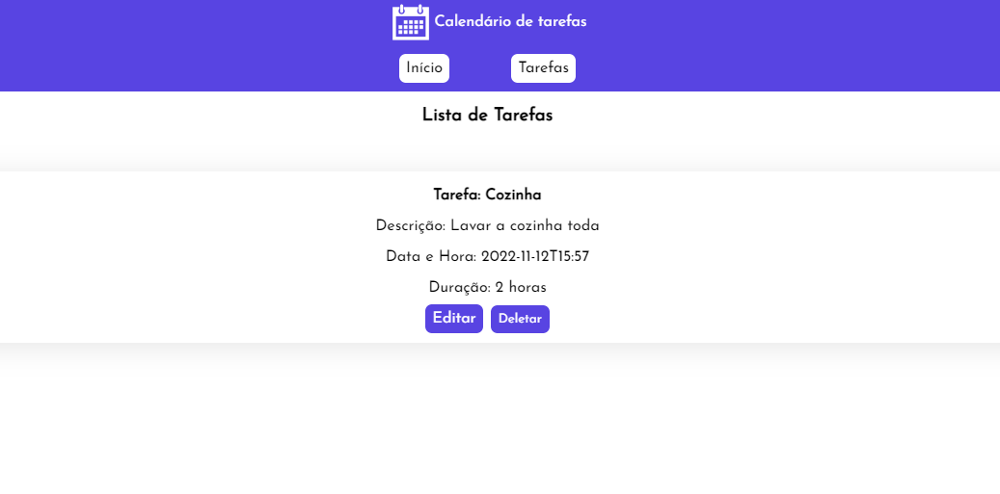
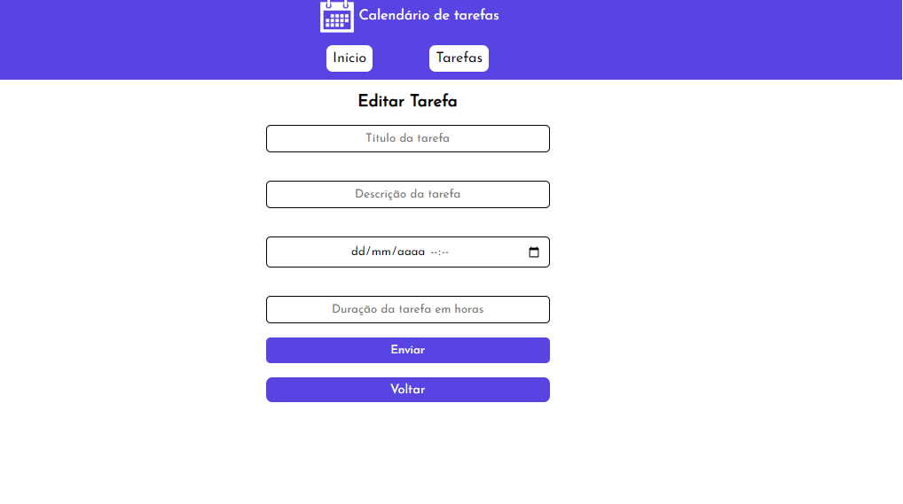

<h1 align="center">Calendário de Tarefas</h1>

# Resumo do projeto

Aplicativo para cadastro de tarefas totalmente responsivo para web e mobile. É posssível adicionar, editar e remover tarefas.
 

# <h3 align="left"> :coffee: Tecnologias utilizadas: </h3>

- `React`
- `SASS`
- `NodeJs`
- `Express`
- `MongoDB`

# <h3 align="left"> 💻 Inicialiação do projeto: </h3>

Na pasta client, executar o comando `npm run dev`.
Ja na pasta server, o comando `npm run server`

# <h3 align="left"> 🎨 Imagens do projeto: </h3>

